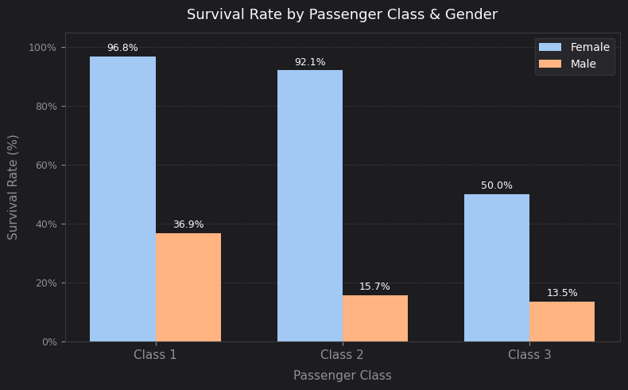
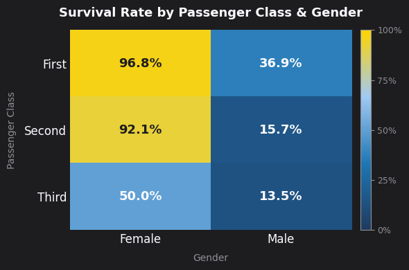

# Titanic Data Analysis & Visualization

An exploratory data analysis (EDA) and data visualization project utilizing the classic Titanic dataset. This project focuses on end-to-end data processing—from handling missing data to crafting tailored, presentation-ready visualizations—to uncover the key demographic drivers behind passenger survival rates.

## 🛠️ Tech Stack & Libraries
*   **Language:** Python
*   **Data Manipulation:** Pandas, NumPy
*   **Data Visualization:** Matplotlib (Custom dark-themed styling)

## 🗂️ Project Structure
*   `Titanic_Survival_Analysis.ipynb`: The main Jupyter Notebook containing the full data cleaning, analysis, and visualization code.
*   `sample_data/titanic.csv`: The raw historical dataset containing information on 891 passengers.

## ⚙️ Data Pipeline & Processing

### 1. Data Imputation
Handled missing values using statistical metrics to ensure data integrity before visualization:
*   **Age:** Imputed 177 missing values using the column median ($28.0$).
*   **Embark Town:** Imputed 2 missing values using the column mode (`'Southampton'`).

### 2. Grouped Bar Chart Analysis
Calculated precise survival percentages segmented by socio-economic standing (passenger class) and gender, utilizing custom-styled inline labels to emphasize the distinct gaps.

### 3. Correlation Heatmap
Developed an annotated matrix featuring a custom dark-blue to gold colormap (`#1F3A5F` → `#ffd400`) to visually isolate the strongest survival predictors.

---

## 📊 Key Insights & Findings

### The "Women and Children First" Protocol Was Real
The historical evacuation protocol heavily favored female passengers across the board. Gender was the single most dominant survival factor. 

| Class | Female Survival | Male Survival | The Survival Gap |
| :--- | :---: | :---: | :---: |
| **First Class** | 96.8% | 36.9% | **+59.9 pts** |
| **Second Class** | 92.1% | 15.7% | **+76.4 pts** |
| **Third Class** | 50.0% | 13.5% | **+36.5 pts** |

*   **Class vs. Gender:** Socioeconomic class mattered immensely for women, dropping from **96.8%** in first class to **50.0%** in third class. 
*   **The Ultimate Divide:** Even with the class drop, a third-class female passenger ($50.0\%$) had significantly higher survival odds than a first-class male passenger ($36.9\%$).
*   **Male Survival Rates:** Survival rates for men remained uniformly grim across the board, providing only marginal safety benefits even in higher classes.





---

## 🚀 How to Run the Notebook
1. Clone this repository:
   ```bash
   git clone [https://github.com/YOUR-USERNAME/YOUR-REPO-NAME.git](https://github.com/YOUR-USERNAME/YOUR-REPO-NAME.git)
